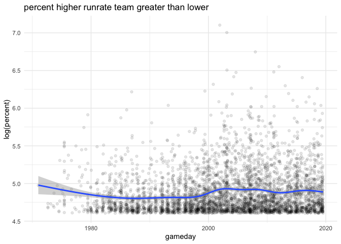
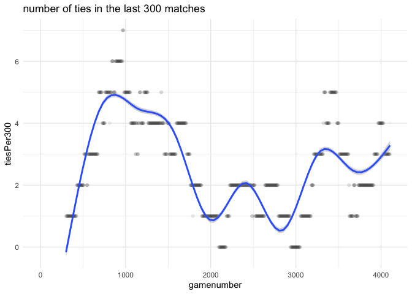
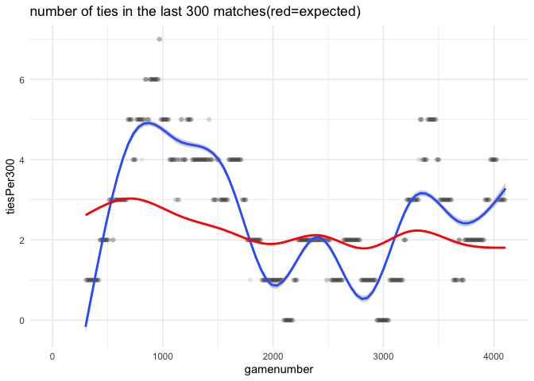

Are One Day International cricket teams becoming more even
================

On Twitter I posed the question “Are One Day International cricket teams
becoming more even” and provided the match summary data of every innings
of each (men’s) One Day International cricket match.

Original tweet is at:
<https://twitter.com/Thoughtfulnz/status/1150940414284718080>

It is a very open question as to what “becoming”, “more”, and “even”
mean. So this is my analysis based on my assumptions. If you want to do
your own analysis, the data is at:
<https://github.com/thoughtfulbloke/ODI_results>

``` r
library(dplyr)
library(tidyr)
library(lubridate)
library(ggplot2)
library(purrr)
```

I am downloading the data directly into R across the internet, by
loading in the raw form of the csv from github.

``` r
if(!file.exists("ODI.csv")){
  ODI <- read.csv("https://raw.githubusercontent.com/thoughtfulbloke/ODI_results/master/ODISto201907015.csv", stringsAsFactors = FALSE)
  write.csv(ODI, "ODI.csv", row.names = FALSE)
}
ODI <- read.csv("ODI.csv", stringsAsFactors = FALSE)
```

For those not used to cricket, in a normal match one team takes an
innings at bat, until 50 overs have passed or the team has been bowled
out. Then the other team has an innings at bat until either it exceeds
the first teams total, 50 overs have been played, or the team has been
bowled out.

However, special circumstances can occur- for example if rain interupts
the second innings under some conditions on some of the runs scored in
the first innings will be counted to determine a win. This can mean that
in some cases the team that scores less wins, or teams score a different
number of runs bu tie the match. In those cases there is generally some
clue in the score (not all players batted) and number of Overs played
(the second innings was less than 50). Overs

With the “becoming more even” part of the question, there are many
possible measures of eveness. For example, are the differences in score,
allowing for shortend games (and the choosing if it is appropriate to
adjust by ground size and conditions), becoming less. I am going to base
my analysis on “more even” as a increase in similarity, which is not
exactly the same thing as a decrease in difference.

The data is one line per innings, with the following fields, Team
(batting team of the inning), Score (runs/wickets out), Overs (total
overs of the innings), RPO (average runs per over for the innings), Inns
(the 1st or 2nd innings of the match), Result(outcome for the team
batting in this innings), Opposition (the team they were playing
against), Ground (where the match took place), ans Start.Date(as due to
rain a One Day International can take more than one day).

Overs normally consist of six bowled balls, except back when there were
also eight ball over matches, or occasions when a no-ball delivery was
declared where a point is given and the bowler is instructed to repeat
the delivery. Eight ball over matches, which leads to an inflated runs
per over calculation compared to that of six ball overs, are marked in
the Overs field with a x8 mark (I knew none of this before I began
checking the dat for consistancy then reading some history ot explain
the inconsistancies). From checking the data, where the over was only
partially complete, the number of balls bowled is listed in the form of
a count number in the decimal place space in the over field (ranging
from 1 to 5, or 1 to 7 in the case of 8 ball over games).

For that reason, I am going to assume a constant no-ball rate, and
recalculate runs per over as runs per ball.

Because the data is for innings, should one wish to reconstruct matches,
be aware that sometimes more than one match is recorded on the same date
at the same location, so to accurately join the innings would also need
to be done on the combination of team and opposition information. This
could be done as a database style merge or some sorting and grouping.

``` r
In1 <- ODI %>% filter(Inns == 1) %>%
  select(-RPO, -Inns) %>% mutate(Opposition = gsub("^v ", "",Opposition))
names(In1) <- c("I1Team", "I1Score", "I1Overs", "I1Result",
                "I2Team", "Ground", "Start.Date")
In2 <- ODI %>% filter(Inns == 2) %>%
  select(-RPO, -Inns) %>% mutate(Opposition = gsub("^v ", "",Opposition))
names(In2) <- c("I2Team", "I2Score", "I2Overs", "I2Result",
                "I1Team", "Ground", "Start.Date")
game <- In1 %>% inner_join(In2, 
                           by = c("I1Team", "I2Team", "Ground", "Start.Date")) %>%
  separate(I1Score, into=c("I1score", "I1wickets"), sep="/", 
           fill="right", convert = TRUE) %>%
  separate(I2Score, into=c("I2score", "I2wickets"), sep="/", 
           fill="right", convert = TRUE) %>%
  separate(I1Overs, into=c("I1overs", "I1ballsPerOver"), sep="x", fill="right") %>%
  separate(I1overs, into=c("I1Overs", "I1balls"), sep="\\.", 
           fill="right", convert=TRUE) %>%
    separate(I2Overs, into=c("I2overs", "I2ballsPerOver"), sep="x", fill="right") %>%
  separate(I2overs, into=c("I2Overs", "I2balls"), sep="\\.", 
           fill="right", convert=TRUE) %>%
  mutate(I1balls = ifelse(is.na(I1balls), 0, I1balls),
         I2balls = ifelse(is.na(I2balls), 0, I2balls),
         I1BPO = ifelse(is.na(I1ballsPerOver), 6, 8),
         I2BPO = ifelse(is.na(I2ballsPerOver), 6, 8))

nogame <- In1 %>% anti_join(In2, by = c("I1Team", "I2Team", "Ground", "Start.Date"))
```

## It’s like raaain on your playing day

It may be too rainy for the second team to bat at all (which is why
there are more first innings than second, and the ones with no second
are marked n/r for no result). Or rain may partially effect one or more
innings. This could in theory mean that teams get the same score, but
due to rain calculations the game is not tied.

``` r
game %>% filter(I1score == I2score, I1Result != "tied") %>% nrow()
```

    ## [1] 7

``` r
game %>% filter(I1score != I2score, I1Result == "tied") %>% nrow()
```

    ## [1] 4

There are seven cases where the scores were the same, but the match was
not tied, and 4 cases where the match was tied but the scores were not
the same. So for a similarity measure I am going to ignore official
results and focus on score and playing time.

For rain shortend, where I feel that is not a reflection of playing
skill, I am using the following principles: - Where a team was bowled
out (losing all wicked, marked by not having a wicket entry) the length
of the innings (the denominator of the run rate) is the full length of
the innings (because as I represent the data, they had the opportunity
to score runs if the had people to bat) - Where the innings was
concluded early (marked by have a total overs of less than 50), either
by rain or by the second innings winning before the last over, the
length of the innnings is the amount of time the team batted (as they
had the team members to bat more, so not batting more was not a matter
of skill).

``` r
#rpb = runs per ball
rates <- game %>% mutate(
  I1rpb = ifelse(is.na(I1wickets),
                 I1score/(50 * I1BPO),
                 I1score/(I1Overs * I1BPO + I1balls)),
  I2rpb = ifelse(is.na(I2wickets),
                 I2score/(50 * I2BPO),
                 I2score/(I2Overs * I2BPO + I2balls)),
  gameday = dmy(Start.Date)
) %>% select(gameday, I1Team, I1rpb, I2Team, I2rpb, I1score, I2score, I2balls) %>%
  arrange(gameday)
```

## Location, location, location

Different venues have different conditions (pitch/grass conditions) and
characteristices (distance to boundaries), so I want to avoid
comparisons being influenced by what venue a match was played at, which
means not looking at run rate in isolation. Instead I am looking at the
higher scoring run rate in relation to the lower scoring run rate, at
the same venue on the same day. And because there have been some blowout
scores, I will visualise with a log transformed axis

``` r
rates %>% mutate(percent = ifelse(I1rpb > I2rpb,
                               100*I1rpb/I2rpb,
                               100*I2rpb/I1rpb)) %>%
  ggplot(aes(x=gameday, y=log(percent))) + geom_point(alpha=0.1) + 
  geom_smooth(method = 'gam', formula = y ~ s(x, bs = "cs")) +
  theme_minimal() + ggtitle("percent higher runrate team greater than lower")
```

<!-- -->

On that basis the general scoring differentials there is not a lot of
difference over time, but…

What caused me to look into this was actual ties, not typical match
differences, though that initial observation was based on declared
results, so lets check “same run rates after all adjustments per 300
matches”

``` r
ties <- rates$I1rpb == rates$I2rpb
last300 <- 300:length(ties)
tiesPer300 <- sapply(last300, function(x){sum(ties[(x-299):x])})
rates$tiesPer300 <- c(rep(NA_real_, 299), tiesPer300)
rates$gamenumber <- 1:nrow(rates)
ggplot(rates, aes(x=gamenumber,y=tiesPer300)) +geom_point(alpha=0.02) + 
  geom_smooth(method = 'gam', formula = y ~ s(x, bs = "cs")) +
  theme_minimal() + ggtitle("number of ties in the last 300 matches")
```

    ## Warning: Removed 299 rows containing non-finite values (stat_smooth).

    ## Warning: Removed 299 rows containing missing values (geom_point).

<!-- -->

Which is, more or less, what I noticed original with match results, in
which case “more even”, expressed as number of ties, depends on the
history you are comparing it against- recent history **no**, a medium
length time period **yes**, the full time period **no**

But as Jonathan Marshall pointed out on Twitter the chance of a tie is
senstive to the runrate of the innings, essentially since higher
runrates have a wider distribution of possible results.

<https://twitter.com/jmarshallnz/status/1150602681678880769>

To model this, my final step to calculate the expected chance of the
Innings 2 team getting the same score as the innings 1 team (on the
basis of a Poisson distribution), given the run rate of the innings 2
team, then comparing it to observed number of ties. This is what I
wanted to do all along, but I needed to check that it was still a useful
thing to do after accounting for all the structural features in the data
that I have.

A poisson (count) distribution is a simplification, but it is a
simplification appropriate to the level of detail in the data. Going
deeper, and exploring things like the dependence of particular teams on
particular players, would require data not in this analysis.

``` r
#assuming they were all 50 over, 6 ball per over matches
rates$expected <- dpois(round(rates$I1rpb*300,0), round(rates$I2rpb*300,0))
expectedtiesPer300 <- sapply(last300, function(x){return(sum(rates$expected[(x-299):x]))})
rates$expectedtiesPer300 <- c(rep(NA_real_, 299), expectedtiesPer300)
ggplot(rates, aes(x=gamenumber,y=tiesPer300)) +geom_point(alpha=0.02) + 
  geom_smooth(method = 'gam', formula = y ~ s(x, bs = "cs")) +
  geom_smooth(aes(y=expectedtiesPer300),method = 'gam', 
              formula = y ~ s(x, bs = "cs"), colour="red") +
  theme_minimal() + ggtitle("number of ties in the last 300 matches(red=expected)")
```

    ## Warning: Removed 299 rows containing non-finite values (stat_smooth).
    
    ## Warning: Removed 299 rows containing non-finite values (stat_smooth).

    ## Warning: Removed 299 rows containing missing values (geom_point).

<!-- -->

That’s interesting. The movements look, to the eye, to be in a
progression through time periods. If it is, that means something
interesting is happening around ties specifically (a realatively rare
event), that is not strongly affecting the overall difference in
performance between teams. Possibly something about the way particularly
evenly matched teams are playing each other.

If it is.

As a fundamentally rare event (36 in 4106 matches, basically 1 in 1000)
we can say that if these are real differences then the peaks are being
caused by ties occuring closer together in time than they would as a
natural random arrangement. And when you have unusual situations that
can be compared to natural random arrangements, you have a simulation
test.

I’m not going to use the carefully calculated expected values, because
that would be the chance of seeing a result like this given how even the
teams are over time. What I want is how unusual is it to see patches of
evenness (ties) like this over time.

To measure this, with 36 ties there are are 35 intervals between tied
games, the sum(17 longest gaps) / sum(17 shortest gaps) gives a number
that is higher the more that tied games are close together. In
simulations I can randomly position the ties, and see how unlikely
reality is. At 100000 simulations, this is the slowest part of the
script.

``` r
real_position <- which(rates$I1rpb == rates$I2rpb)
real_gaps = sort((real_position - c(NA, real_position[1:35]))[2:36])
real_ratio = sum(real_gaps[19:35])/sum(real_gaps[1:17])
tie_simulation <- function(){
  random_places <- sort(sample(1:4106, size=36, replace=FALSE))
  random_gaps <- sort((random_places - c(NA, random_places[1:35]))[2:36])
  sum(random_gaps[19:35])/sum(random_gaps[1:17])
}
many_simulations <- replicate(100000, tie_simulation())
sum(real_ratio >= many_simulations) / 100000
```

    ## [1] 0.48609

The result suggests that given 36 ties in 4106 matches, we would expect
to see something that looked like that amount of temporal clustering, or
more, about half the time. So, no, in fact no unusual changes are
happening.
